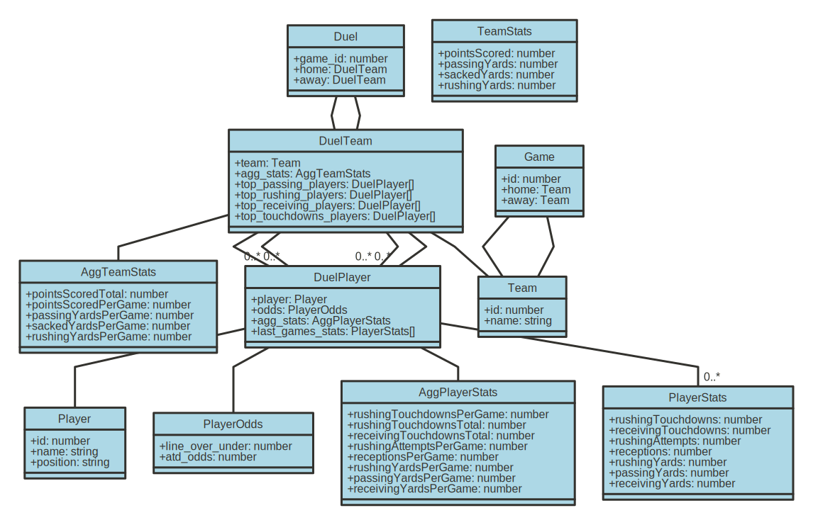

Verified Global Homework, built with [Next.js](https://nextjs.org/).

### Requirements

- Node 21 & NPM

## Getting Started

```bash
npm install
npm run dev
```

Open [http://localhost:3000](http://localhost:3000) with your browser to see the result.

## Backend REST API

### List NFL games

Lists all NFL games coming up.

`GET /api/nfl/games`

### Get data duel

Get the data duel statistics for an NFL game

`GET /api/nfl/games/{game_id}/duel`

## Data Model

- UML Class Diagram of the data model for the NFL Data Duels
- Drawn using [TsUML2](https://github.com/demike/TsUML2)



## TODOs

- add teams points spread in the data duel
- tests